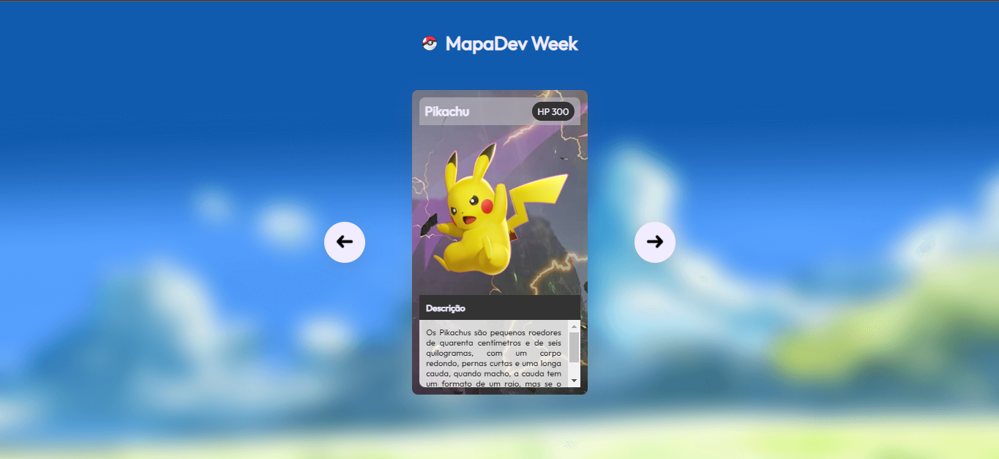

# MapaDev Week - Desafio Pokemón Slider

Projeto construído no evento MapaDev Week da equipe Dev em Dobro. design responsivo utilizado conceitos avançados de CSS, como grid, flexbox e também efetuado ações dos botões com Javascript

[Clique aqui para acessar](https://edu-almeidaf.github.io/mapadev-week-pokemon-slider/)

---

## Tecnologias Utilizadas:

- HTML
- CSS
- Javascript
- Git e Github

---

## Contato

[Linkedin](https://www.linkedin.com/in/almeidaedu/)
